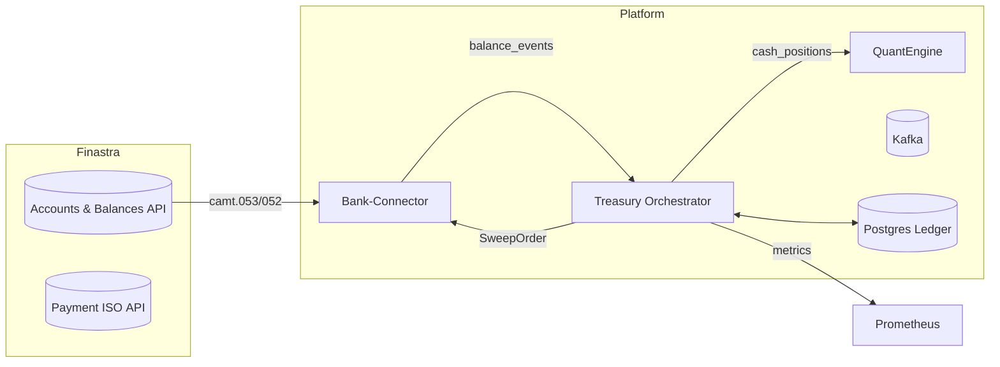

# Treasury Orchestrator Specification

> **File:** `/docs/treasury-orchestrator.md`
> **Last Updated:** 

---

## 1  Purpose

The Treasury Orchestrator (TO) is the decision‑making service that:
1. Consumes real‑time and prior‑day balance events from Finastra‑sourced accounts.
2. Applies liquidity buffer, VaR, and allocation policies.
3. Emits signed *Sweep Orders* for execution by the **Bank‑Connector**.
4. Publishes state and metrics for reconciliation, audit, and observability.

This document describes its architecture, message contracts, algorithms, persistence, and operational requirements for the Finastra integration MVP.

---

## 2  Context & Actors



| ID                 | Actor                        | Responsibility                                              |
| ------------------ | ---------------------------- | ----------------------------------------------------------- |
| **ACCT-SVC**       | Finastra Accounts & Balances | Provides book & intraday positions (camt.053/052 equiv.)    |
| **PAY-SVC**        | Finastra Payment ISO API     | Executes `pain.001` / `pacs.008` created by Bank‑Connector  |
| **BANK‑CONNECTOR** | O&L micro‑service            | Normalises Finastra JSON ↔ ISO 20022; owns settlement calls |
| **TREASURY ORCH**  | *This service*               | Decides whether, when, and how much to sweep                |
| **QUANTENGINE**    | O&L trading core             | Needs current cash so it can invest excess                  |

---

## 3  Message Contract

### 3.1 `SweepOrder` (Kafka topic `sweep_intent` & REST pull)

```jsonc
{
  "order_id": "SWP-2025-06-10-0001",           // ULID or UUIDv7
  "source_account": "0123456789",              // Finastra DDA
  "target_product": "FED_RRP",                // enum: FED_RRP | TBILL_4W | CARBON_NOTE | ...
  "amount_usd": 750000.00,                     // decimal(20,4)
  "cutoff_utc": "2025-06-11T00:00:00Z",       // ISO‑8601
  "risk_checks": {
    "var_limit_bps": 10,                       // max allowed VaR
    "observed_var_bps": 8                     // actual
  },
  "created_ts": "2025-06-10T19:42:11.818Z"
}
```

JSON‑Schema (v2020‑12) is stored in `/schemas/sweep_order.schema.json` with semantic‑versioning.

---

## 4  Configuration

| Key                  | Default             | Description                                  |
| -------------------- | ------------------- | -------------------------------------------- |
| `LIQ_BUFFER_PCT`     | `0.30`              | % of forecasted 24 h outflows to keep on DDA |
| `VAR_LIMIT_BPS`      | `10`                | Breach triggers 100 % FED_RRP fallback      |
| `SWEEP_CUTOFFS_UTC`  | `['00:30','15:30']` | Allowed submission windows                   |
| `TARGET_LADDER_DAYS` | `28`                | Tbills ladder duration                       |

Configuration is hot‑reloadable via Consul KV & re‑broadcast on Kafka topic `orch_config_updates`.

---

## 5  Decision Algorithm

```pseudocode
Input: balances, eod_projection, var_bps
if var_bps > VAR_LIMIT_BPS:
    product ← FED_RRP
    amount ← max(0, balances.excess)
else:
    target_float ← LIQ_BUFFER_PCT * eod_projection
    amount ← max(0, balances.excess - target_float)
    product ← (CARBON_NOTE if ESG_pref else TBILL_4W)
if amount ≥ MIN_SWEEP_USD:
    emit SweepOrder(product, amount)
```

The VaR engine uses 1‑day 99 % historical VaR over the last 250 trading days of casino net cashflows.

---

## 6  Persistence Model

```mermaid
erDiagram
    BALANCE ||..|| ACCOUNT : has
    SWEEP_ORDER ||--|| ACCOUNT : targets
    BALANCE {
        bigint id PK
        varchar account_id FK
        timestamptz as_of_ts
        numeric(20,4) avail_usd
        jsonb raw_event
    }
    SWEEP_ORDER {
        bigint id PK
        varchar order_id UQ
        varchar account_id FK
        numeric(20,4) amount_usd
        varchar product
        timestamptz cutoff_utc
        varchar status  -- NEW | SENT | ACK | FAILED
    }
```

---

## 7  Interfaces

### 7.1 Kafka

| Topic            | Key          | Value                              | Note |
| ---------------- | ------------ | ---------------------------------- | ---- |
| `cash_positions` | `account_id` | Balance snapshots from QuantEngine |      |
| `sweep_intent`   | `order_id`   | `SweepOrder` objects (↑)           |      |

### 7.2 REST (internal)

| Verb   | Path                           | Purpose                                       |
| ------ | ------------------------------ | --------------------------------------------- |
| `GET`  | `/sweep-intent?after=<cursor>` | Idempotent pull for Bank‑Connector            |
| `POST` | `/balances`                    | Webhook for immediate balance push (optional) |

---

## 8  Observability

- **Prometheus metrics**
  - `treasury_swept_usd_total{product="FED_RRP"}`
  - `treasury_var_bps`
  - `sweep_decision_latency_seconds` (95‑th ≤ 0.50 s)
- **Structured logs** — JSON with `trace_id`, `order_id`, `decision`.
- **Grafana dashboard** — `/grafana/treasury.json`.

---

## 9  Security & Compliance

- mTLS (TLS 1.3) on all in‑cluster gRPC/REST traffic.
- Hashicorp Vault Transit for database key‑encryption and JWT signing keys.
- BSA/AML tags propagated via `additionalInfo` field in `pain.001` generated downstream.
- All code paths behind FFIEC ASVS‑L2 static‑analysis gate.

---

## 10  Deployment

- Container image: `ghcr.io/oandl/treasury-orch:<sha>`
- Runtime: AWS ECS Fargate (2 vCPU, 4 GiB, 1 Replica for MVP; HPA on `sweep_decision_latency_seconds`‑P95 > 800 ms).
- Environment vars defined in Terraform module `ecs/treasury_orch.tf`.

---

## 11  Testing Strategy

| Layer       | Tooling                         | Coverage                      |
| ----------- | ------------------------------- | ----------------------------- |
| Unit        | `pytest`, `hypothesis`          | ≥ 90 % lines, ≥ 70 % branches |
| Integration | docker‑compose w/ Mock‑Finastra | Sweep cycle, edge cases       |
| Load        | k6 script `load/sweep_24h.js`   | sustain 10 msg/s for 1 h      |
| Chaos       | `chaos‑mesh` pod kill           | No order loss, retry < 2 min  |

---

## 12 Glossary

| Term         | Meaning                                                    |
| ------------ | ---------------------------------------------------------- |
| **VaR**      | Value at Risk; 1‑day 99 % quantile of outflow distribution |
| **FED_RRP** | Fed Reverse‑Repo Facility overnight sweep product          |
| **ESG**      | Environmental, Social, Governance investment preference    |

---

### © O&L 2025
